<!-- ### Hi there 👋 -->

<!--
**TheWhiteDog9487/TheWhiteDog9487** is a ✨ _special_ ✨ repository because its `README.md` (this file) appears on your GitHub profile.

Here are some ideas to get you started:

- 🔭 I’m currently working on ...
- 🌱 I’m currently learning ...
- 👯 I’m looking to collaborate on ...
- 🤔 I’m looking for help with ...
- 💬 Ask me about ...
- 📫 How to reach me: ...
- 😄 Pronouns: ...
- ⚡ Fun fact: ...
-->

<h1 style="text-align: center;">各位早呐，这里是TheWhiteDog9487的Github主页</h1>

  

    <picture>
      <source
        media="(prefers-color-scheme: dark)"
        srcset="./profile/stats_dark.svg" />
      
    </picture>
    <picture>
      <source
        media="(prefers-color-scheme: dark)"
        srcset="./profile/top-langs_dark.svg" />
      
    </picture>
  

- 我的主要活动区域：
    - 
    - 
    - )
    - 
    - [Minecraft ID: TheWhiteDog9487](https://zh-cn.namemc.com/profile/TheWhiteDog9487)
    - [邮件: thewhitedog9487@outlook.com](mailto:TheWhiteDog9487<thewhitedog9487@outlook.com>)

- 主要技术
    - 主要
        - C++
            - Qt
        - Java
            - SpringBoot
            - Minecraft Mod
                - Fabric
        - Python
    - 能用
        - Kotlin
        - TypeScript
        - C#
        - PowerShell
    - 正在学 / 希望学
        - Android
            - Jetpack Compose
        - Web前端
            - Nuxt
            - Next.js
            - Tailwind CSS
---

有什么问题，或者单纯想找个人吹吹牛聊会天，欢迎来找我。  
不要害羞，如果我觉得不行，我拒绝就是了。  
所以不要望而却步，欢迎来找我（*＾-＾*）

---
我开源的大多数东西，都是因为我自己需要，而没有现成的可用方案。  
所以我就自己上了。
